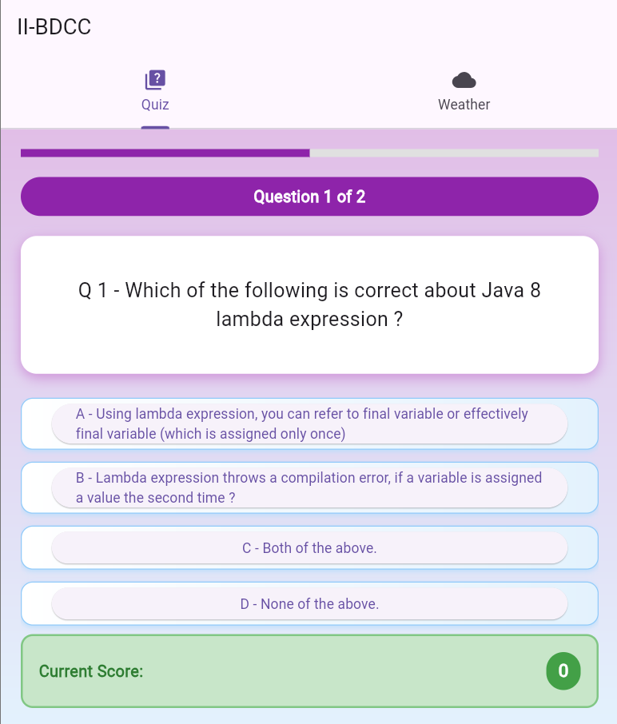
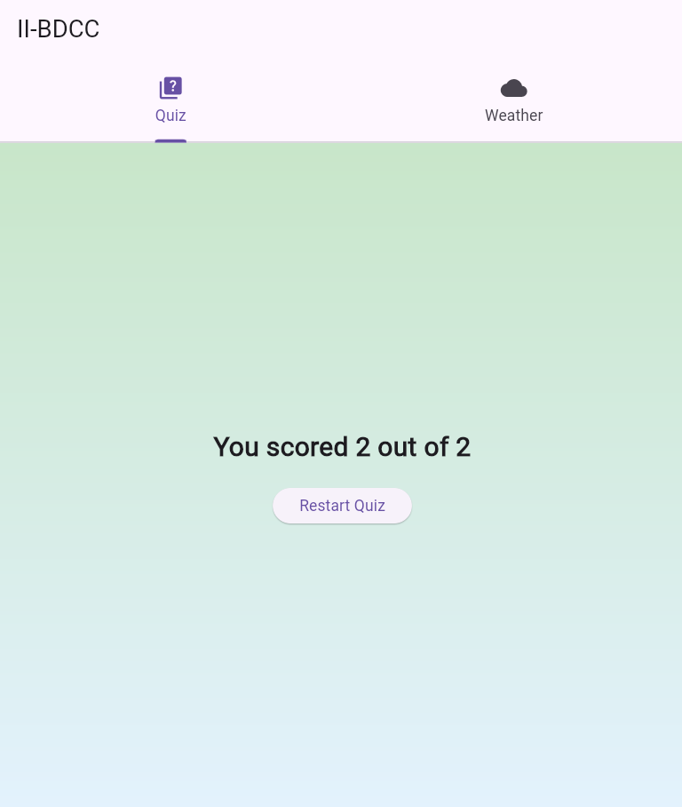
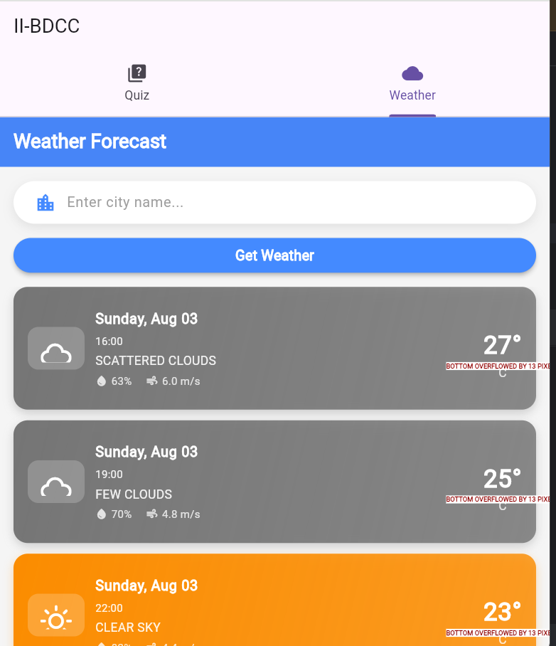
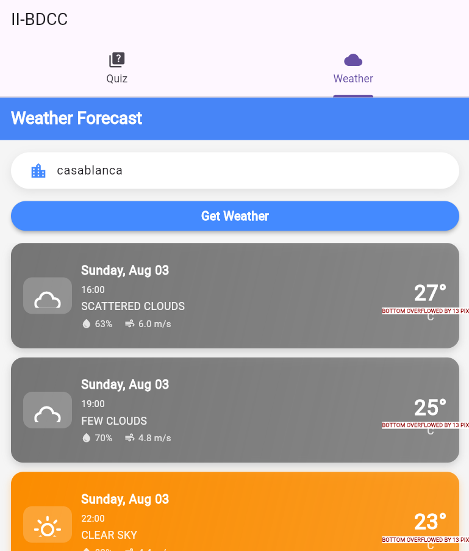

# INTERACTIVE_DEMO – Dual-Purpose Flutter Application

A cross-platform mobile solution built with Flutter, integrating two distinct interactive modules:
- An engaging **Trivia Challenge** system for user interaction and entertainment.
- A comprehensive **Climate Tracker** powered by live meteorological data via OpenWeather services.

---

## Application Architecture

```
lib/
├── main.dart
├── answer.dart
├── question.dart
├── quiz.dart
├── score.dart
├── weather.dart
```

---

## Core Capabilities

### Trivia Challenge Component
- Multi-choice question framework with varied topics
- Real-time performance analytics and scoring system
- Instant response validation with user feedback mechanisms

### Climate Tracker Component
- Integration with `OpenWeatherMap REST API` for live atmospheric data
- Comprehensive weather insights including temperature readings, meteorological conditions, and location-based forecasts
- Secure API credential management through environment configuration

---

## Configuration Setup

Establish a `.env` configuration file in the project root directory:

```env
OPENWEATHER_API_KEY=your_personal_api_token
```

---

## Required Packages

Essential Flutter dependencies:
- flutter_dotenv
- http

Package installation command:

```bash
flutter pub get
```

---

## Launch Instructions

Execute the application:

```bash
flutter run
```

---

## Visual Documentation










## Auteur

**Hanane Nahim**