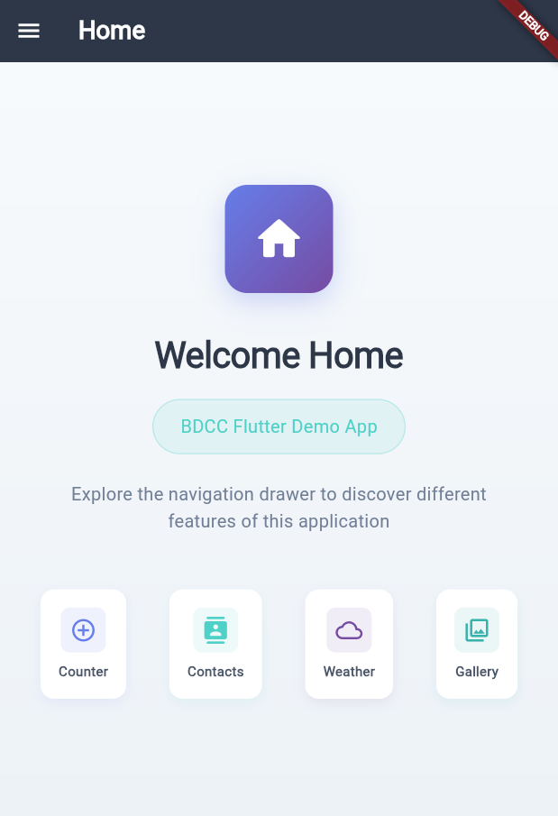
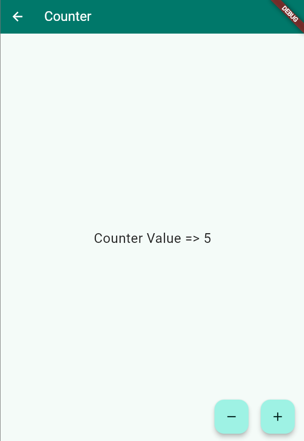
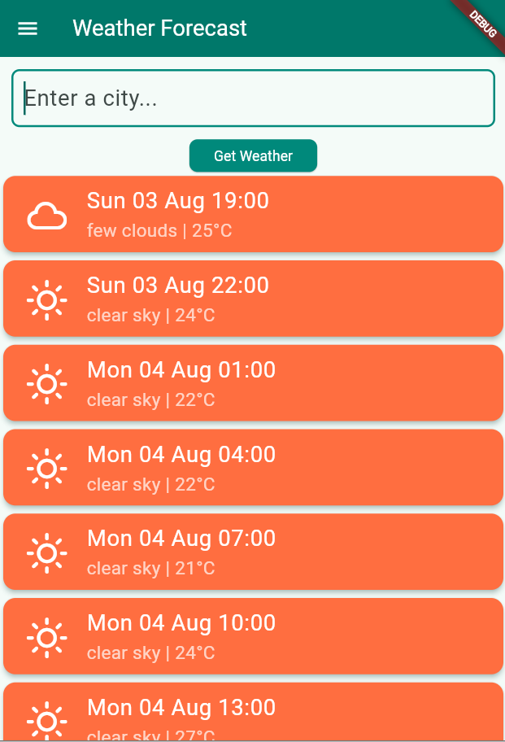
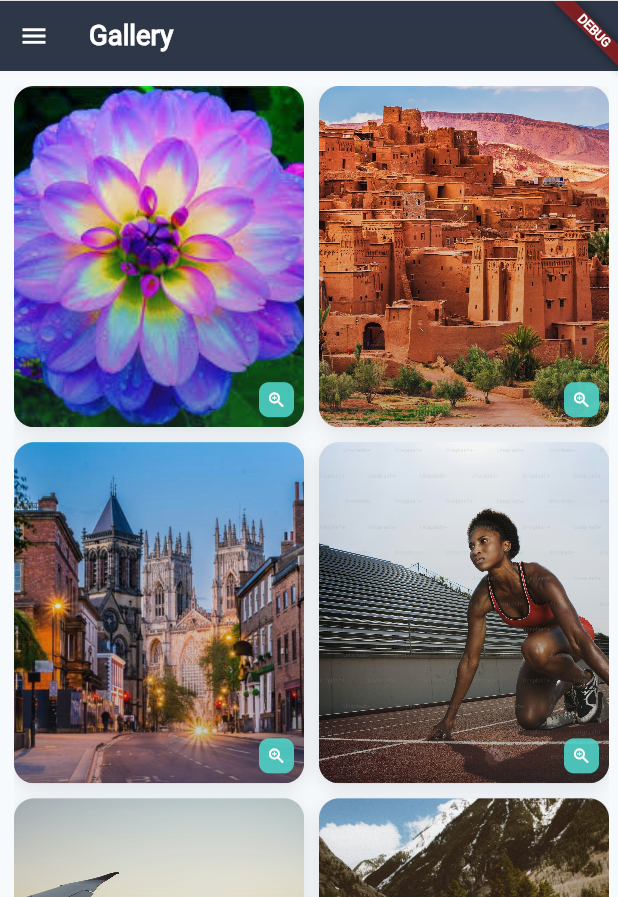

# 📱 Flutter Mobile Showcase – BDCC Interactive Demo

A comprehensive Flutter mobile application created for the BDCC (Big Data & Cloud Computing) program. This project highlights essential Flutter development patterns including drawer navigation, state management, external API integration (OpenWeather service), contact management, image galleries, and interactive components.

---

## Core Functionality

- Smooth Navigation Drawer with elegant animations
- Interactive Counter Component (stateful widget demo)
- Contact Management Interface (mock data implementation)
- Weather Dashboard (OpenWeatherMap API integration)
- Image Gallery (grid-based layout with local assets)
- Cross-platform compatibility (emulator & physical device support)

---

## 📷 Application Preview

<table>
  <tr>
    <td></td>
    <td></td>
    <td></td>
    <td></td>
    <td></td>
    <td></td>
  </tr>
  <tr>
    <td align="center"><b>Navigation Menu</b></td>
    <td align="center"><b>Home</b></td>
    <td align="center"><b>Interactive Counter</b></td>
    <td align="center"><b>Contact List</b></td>
    <td align="center"><b>Weather Info</b></td>
    <td align="center"><b>Image Gallery</b></td>
  </tr>
</table>

---

## 🚀 Getting Started

1. **Clone the repository**
   ```bash
   git clone https://github.com/hanane1109/flutter_demo_app2.git
   cd flutter-bdcc-demo
   ```

2. **Fetch dependencies**
   ```bash
   flutter pub get
   ```

3. **Launch the application**
   ```bash
   flutter run
   ```

> **Important:** Create a `.env` file in the root directory and add your `OPENWEATHER_API_KEY` for weather functionality.

---

## Project Architecture

```
lib/
├── main.dart
├── screens/
│   ├── home.screen.dart
│   ├── counter.screen.dart
│   ├── contacts.screen.dart
│   ├── weather.screen.dart
│   └── gallery.screen.dart
└── components/
    ├── drawer.header.component.dart
    ├── drawer.item.component.dart
    └── navigation.drawer.component.dart
```

---

## Developer

**Hanane Nahim**

*BDCC Mobile Development Project*
